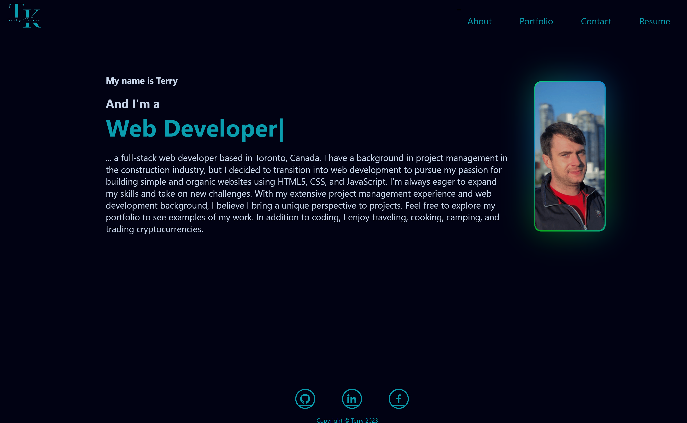

# Terry-s-Portfolio-with-REACT

## Description

Portfolio Web Page project that shows skills learned at University of Toronto bootcamp.

I have created this project to help me to find future potential employers looking to fill a part-time or full-time web development positions.

It contains information about me, projects I have been working on during bootcamp with icons to deployed project pages and GitHub repository links, resume page to download PDF formated resume, and a page to conatct me.

Creating Portfolio I have used REACT.js, CSS and Node.js


## Table of contents

- [Installation](#installation)
- [Usage](#usage)
- [Screenshot](#screenshot)
- [Contribution](#contribution)
- [Questions](#questions)
- [License](#license)

## Installation


- Clone application [Terry-s-Portfolio-with-REACT](https://github.com/TerryKor/Terry-s-Portfolio-with-REACT)<br />

- To install necessary dependencies, run the following command:
```
npm i
```
- After installing necessary dependencies, run the following command:
```
npm start
```
- Once all the above steps are completed, go to http://localhost:3000/ in your browser

## Usage

- See deplpoyed page [here](https://terrykor.github.io/). Otherwise follow Insatallation instructions<br />

## Screenshot



## Contribution

Application was created by Terry Kornienko and if you want to contribute send me an email.<br />

## Questions

My Email:
[misterfreemann@gmail.com](mailto:misterfreemann@gmail.com)
My Github:
[TerryKor](https://github.com/TerryKor)

## License


<p align="right"><a href="#readme-top">back to top</a></p>